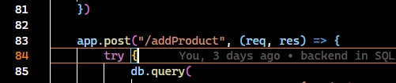

🕵️‍♂️ How to connect with MySQL Workbech \
   📺 https://www.youtube.com/watch?app=desktop&v=2c2fUOgZMmY
  make sure that you have noted down your username and passowrd aswe are going to use it in database.config file 

Once you get conncted with MYSQL Workbech 
enter the username and password in the database config file and database name as well. \
I have made the CRUD(create ,Read Update and Delete )API of Products so you can refer those API to make the changes 

How to start the server \
1) Open your vsCode terminal and type the "npm install" -- It'll install all your required packages inside the  node_modules folder 
2) Once you install the packages type "npm start" and hit enter it'll start your backend server and then you are ready to go .

💻How to call API \
1) Go to Postman and change the method of API request as per the declaration of API in routes

as you can see on above image the method is post ans we are calling the api with the name as "/addProduct"

